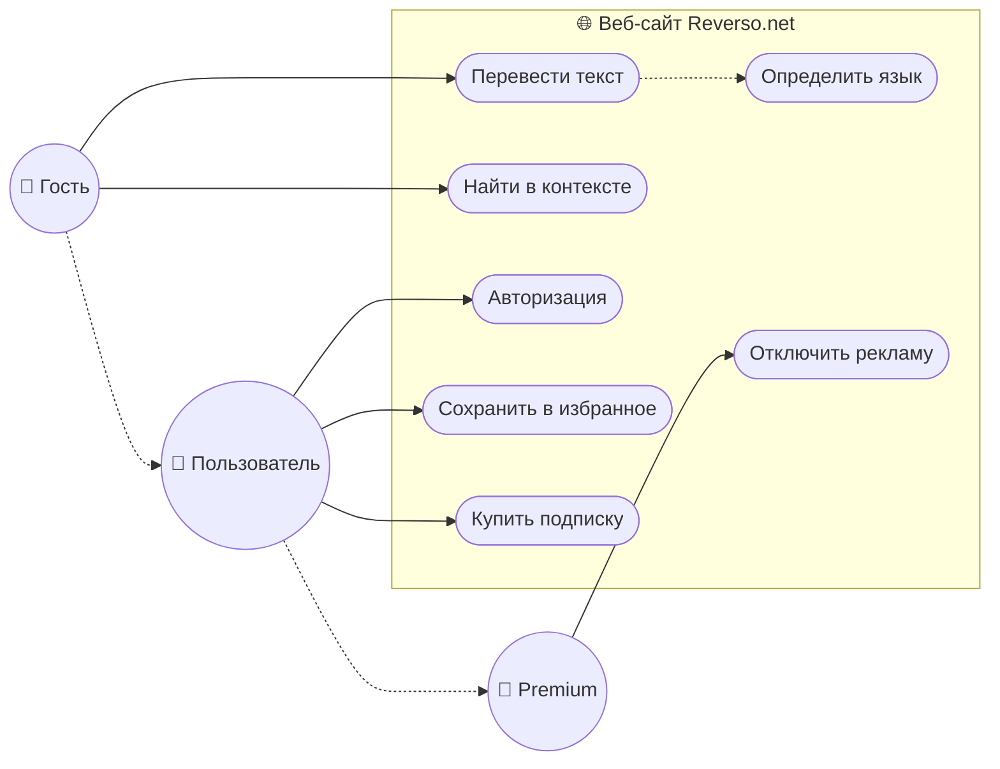

# Software Requirements Specification (SRS)
**Проект:** Reverso.net
**Версия:** 1.0

## 1. Introduction (Введение)

### 1.1. Purpose (Цель документа)
Целью данного документа является формальное описание функциональных и нефункциональных требований к веб-платформе **Reverso.net**. В документе определяются требования конечных пользователей (Гостей, Зарегистрированных пользователей, Premium-подписчиков) и владельцев сервиса. Документ описывает основные прецеденты использования системы, характеристики производительности и интерфейсов.
Документ служит соглашением между заказчиками и командой разработки о том, какая функциональность и качественные характеристики должны быть реализованы в системе.

### 1.2. Scope (Область применения)
Данный документ относится к веб-сайту **Reverso.net** — лингвистической платформе, предоставляющей инструменты для машинного перевода, поиска по контексту (Context), проверки орфографии и спряжения глаголов.
Документ будет использоваться разработчиками (Frontend, Backend) как основа для проектирования архитектуры и реализации функционала, QA-инженерами для составления тест-планов, а также менеджерами проекта для контроля сроков и качества реализации.

### 1.3. Определения и аббревиатуры
*   **NMT (Neural Machine Translation)** — технология машинного перевода, использующая искусственные нейронные сети для предсказания последовательности слов.
*   **Контекстный поиск (Concordancer)** — инструмент, осуществляющий поиск перевода слова или фразы в базе параллельных текстов (корпусе) для отображения примеров употребления.
*   **SaaS (Software as a Service)** — модель предоставления программного обеспечения, при которой поставщик разрабатывает и управляет облачным приложением.
*   **Freemium** — бизнес-модель, при которой базовые услуги предоставляются бесплатно, а расширенные функции — за плату.

### 1.4. Ссылки
*   Веб-сайт проекта: [https://www.reverso.net](https://www.reverso.net)
*   GDPR (General Data Protection Regulation) — регламент ЕС по защите персональных данных: [https://gdpr-info.eu]

### 1.5. Overview (Краткий обзор)
Данный документ содержит следующие разделы:
*   **Общее описание:** Описывает функциональность продукта, характеристики пользователей и предположения.
*   **Спецификация требований:** Содержит детальный список функциональных требований, требований к удобству, надежности, производительности и интерфейсам.
*   **Приложения:** UML-диаграммы, оценка трудоемкости и анализ рисков.

---

## 2. Overall Description (Общее описание)

### 2.1. Функциональность продукта
Система должна предоставлять набор инструментов для работы с иностранными языками.
Основные модули Проекта:
2.1.1. **Переводчик:** Предоставление пользователям возможности машинного перевода текстов большого объема с автоматическим определением языка.
2.1.2. **Reverso Context:** Предоставление функциональности для поиска слов и выражений в базе параллельных текстов с отображением двуязычных примеров.
2.1.3. **Инструменты языка:** Предоставление функций проверки орфографии/грамматики и таблиц спряжения глаголов.
2.1.4. **Личный кабинет:** Возможность сохранения истории поиска, формирования личного словаря ("Избранное") и управления подпиской.

### 2.2. User characteristics (Характеристики пользователей)
*   **Гость (Guest)** — неавторизованный пользователь. Имеет доступ к базовому функционалу (перевод, контекст) с ограничением по количеству запросов и объему текста. Видит рекламу.
*   **Зарегистрированный пользователь (Registered User)** — пользователь, прошедший авторизацию. Имеет доступ к истории поиска, возможность сохранять слова в «Избранное». Видит рекламу.
*   **Premium-пользователь (Subscriber)** — пользователь с активной платной подпиской. Не видит рекламу, имеет увеличенные лимиты на объем переводимого текста, доступ к офлайн-функциям (в мобильной версии) и приоритетную обработку запросов.
*   **Администратор** — сотрудник компании, управляющий контентом, пользователями и анализирующий статистику системы.

### 2.3. Влияющие факторы и зависимости (Assumptions and dependencies)
*   Обеспечение конфиденциальности данных пользователей (история переводов). Влияет на требования к шифрованию трафика и хранению данных (соответствие GDPR).
*   Зависимость от сторонних рекламных сетей (Google AdSense / RTB) для монетизации бесплатной версии.
*   Зависимость от производительности NMT-движков (собственных или сторонних API) для обеспечения скорости перевода.

### 2.4. Ограничения
*   Система должна корректно функционировать в браузерах Chrome (версии 90+), Firefox (88+), Safari (14+), Edge.
*   Для использования голосового ввода и озвучивания текста необходимо наличие у пользователя микрофона и динамиков, а также разрешение браузера на доступ к ним.
*   Бесплатная версия системы ограничивает объем переводимого текста за один раз (до 2000 символов).
*   Невозможность работы с системой при отсутствии интернет-соединения (для веб-версии).

---

## 3. Спецификация требований

### 3.1. Функциональные требования

**Модуль «Перевод и Контекст»**
*   **FR-01.** Система должна предоставлять Пользователю поле для ввода исходного текста с возможностью вставки из буфера обмена.
*   **FR-02.** Система должна автоматически определять язык введенного текста, если Пользователь не выбрал язык вручную.
*   **FR-03.** Система должна предоставлять Пользователю возможность переключать направление перевода нажатием одной кнопки (swap).
*   **FR-04.** Система должна выводить результат машинного перевода в отдельном поле, обеспечивая возможность копирования результата.
*   **FR-05.** Система должна (в режиме Context) выполнять поиск введенного слова или фразы в базе параллельных корпусов и выводить список двуязычных предложений-примеров.
*   **FR-06.** Система должна подсвечивать искомое слово и его перевод в выводимых примерах.
*   **FR-07.** Система должна предоставлять возможность озвучивания (Text-to-Speech) как исходного текста, так и перевода.

**Модуль «Учетная запись и Персонализация»**
*   **FR-08.** Система должна предоставлять возможность регистрации и авторизации через E-mail, Google Account и Facebook API.
*   **FR-09.** Система должна сохранять последние 50 запросов Пользователя в «Истории поиска» (для зарегистрированных пользователей).
*   **FR-10.** Система должна предоставлять Зарегистрированному пользователю возможность добавлять слова и примеры в «Избранное» (личный словарь).
*   **FR-11.** Система должна предоставлять интерфейс для покупки Premium-подписки через интеграцию с платежным шлюзом.

**Модуль «Инструменты»**
*   **FR-12.** Система должна проверять введенный текст на орфографические и грамматические ошибки и предлагать варианты исправления (Spellchecker).
*   **FR-13.** Система должна выводить полную таблицу спряжения глагола при вводе инфинитива в соответствующем разделе.

### 3.2. Usability (Требования к удобству использования)
*   **U-01.** Система должна автоматически определять предпочтительный язык интерфейса на основе настроек браузера пользователя при первом посещении.
*   **U-02.** Интерфейс должен поддерживать «Ночной режим» (Dark Mode) с возможностью ручного переключения.
*   **U-03.** Время доступа к основным функциям (начало ввода текста) должно составлять не более 1 клика с главной страницы.
*   **U-04.** В мобильной версии сайта элементы управления должны быть адаптированы под сенсорный ввод (минимальный размер активной области кнопки — 44x44 px).
*   **U-05.** Система должна предлагать варианты автодополнения (suggestions) при вводе слова в строку поиска с задержкой не более 300 мс.

### 3.3. Reliability (Надежность)
*   **R-01.** Система должна обеспечивать доступность (Uptime) на уровне 99.9% в режиме 24/7.
*   **R-02.** Система должна обеспечивать сохранность данных пользователя (история, избранное) посредством ежедневного резервного копирования базы данных.
*   **R-03.** При сбое внешнего сервиса перевода Система должна выводить понятное пользователю сообщение об ошибке, а не стеке трейс или код ошибки сервера.
*   **R-04.** Среднее время восстановления работоспособности Системы после критического сбоя не должно превышать 30 минут.

### 3.4. Performance (Требования к производительности)
*   **P-01.** Система должна возвращать результат перевода для текста объемом до 500 символов за время, не превышающее 1 секунду (при стабильном соединении клиента от 10 Мбит/с).
*   **P-02.** Поиск контекстных примеров (Context) должен занимать не более 1.5 секунд для базы, содержащей до 100 млн записей.
*   **P-03.** Система должна выдерживать пиковую нагрузку в 5000 одновременных активных сессий без деградации времени отклика более чем на 20%.
*   **P-04.** Размер первой отрисовки контента (FCP) главной страницы не должен превышать 1.2 секунды на 4G-сетях.

### 3.5. Design Constraints (Ограничения разработки)
*   **Frontend:** Использование фреймворка React.js (версия 17+).
*   **Backend:** Микросервисная архитектура на Node.js или Python (FastAPI).
*   **Базы данных:** MongoDB для хранения пользовательских данных и логов; ElasticSearch для полнотекстового поиска по корпусам текстов.
*   **Хостинг:** Система должна быть развернута в контейнерах Docker под управлением Kubernetes.

### 3.6. Интерфейсы

#### 3.6.1. User Interfaces (Пользовательские интерфейсы)
*   **3.6.1.1.** Главная страница должна содержать большую область ввода текста (textarea), занимающую не менее 40% первого экрана.
*   **3.6.1.2.** Панель выбора языков должна быть закреплена над полем ввода и содержать выпадающие списки с флагами стран.
*   **3.6.1.3.** Для бесплатных пользователей рекламные блоки должны располагаться по бокам или снизу от основного контента, не перекрывая функциональные элементы (кнопку «Перевести»).
*   **3.6.1.4.** Личный кабинет должен иметь вкладочную структуру: «История», «Избранное», «Настройки», «Подписка».

#### 3.6.2. Hardware Interfaces (Аппаратные интерфейсы)
Поскольку веб-сайт не имеет специального аппаратного обеспечения, прямые аппаратные интерфейсы отсутствуют. Серверная часть использует стандартные сетевые интерфейсы.

#### 3.6.3. Software Interfaces (Программные интерфейсы)
*   Система должна использовать **Google OAuth 2.0 API** и **Facebook Login API** для аутентификации пользователей.
*   Система должна интегрироваться с платежными шлюзами (**Stripe / PayPal API**) для обработки транзакций Premium-подписки.
*   Система должна использовать **Google AdSense API** (или аналог) для загрузки рекламных баннеров.

#### 3.6.4. Communications Interfaces (Сетевые интерфейсы)
*   Взаимодействие Клиент-Сервер должно осуществляться по протоколу **HTTPS** (TLS 1.2/1.3).
*   Обмен данными должен происходить в формате **JSON** через REST API.
*   Для автодополнения и мгновенного перевода могут использоваться **WebSockets**.

### 3.7. Licensing Requirements (Требования к лицензированию)
*   Reverso.net является проприетарным продуктом. Исходный код закрыт.
*   Используемые библиотеки с открытым исходным кодом должны иметь лицензии типа MIT, Apache 2.0 или BSD (исключая GPL во избежание вирусного эффекта лицензии).

---

## 4. Приложения (Диаграммы и Оценки)

### 4.1. UML Use Case Диаграмма
*(Текстовое описание для построения)*
**Акторы:** Гость, Пользователь, Premium-пользователь.
**Система:** Веб-сайт.
1.  **Гость** -> (Перевести текст), (Найти в контексте), (Прослушать озвучку).
2.  **Пользователь** -> наследует права Гостя + (Войти/Регистрация), (Сохранить в избранное), (Просмотреть историю).
3.  **Premium-пользователь** -> наследует права Пользователя + (Отключить рекламу), (Перевести большой текст).

### 4.2. Оценка требований (Attribute Table)

| ID Требования | Приоритет | Сложность | Оценка (часы) | Стабильность | Аргументация оценки |
|:---|:---|:---|:---:|:---|:---|
| **FR-01..04** (Перевод) | Высокий | Средняя | 80 | Высокая | Реализация UI ввода/вывода, интеграция API перевода, валидация. |
| **FR-05..06** (Context) | Высокий | Высокая | 160 | Средняя | Сложная логика поиска в ElasticSearch, маппинг слов, верстка результатов. |
| **FR-08** (Auth) | Средний | Средняя | 40 | Высокая | Стандартная реализация OAuth + JWT. |
| **FR-09..10** (ЛК) | Средний | Низкая | 30 | Высокая | CRUD операции для истории и словаря. |
| **FR-11** (Оплата) | Высокий | Высокая | 60 | Средняя | Интеграция биллинга, безопасность, тестирование транзакций. |
| **FR-12** (Speller) | Низкий | Средняя | 50 | Средняя | Интеграция сервиса проверки, UI подсветки ошибок. |
| **Итого MVP** | | | **~420 ч.** | | Без учета настройки инфраструктуры и дизайна. |

### 4.3. Анализ рисков

1.  **Сбои сторонних API (Вероятность: Средняя, Влияние: Высокое).**
    *   *Описание:* Если внешний движок перевода или API авторизации станут недоступны, основной функционал сайта сломается.
    *   *Митигация:* Реализация кэширования ответов, наличие резервного провайдера перевода.

2.  **Блокировка рекламы AdBlock (Вероятность: Высокая, Влияние: Среднее).**
    *   *Описание:* Пользователи с блокировщиками не приносят доход.
    *   *Митигация:* Внедрение скриптов детекции AdBlock с просьбой отключить его или купить Premium.

3.  **Утечка пользовательских данных (Вероятность: Низкая, Влияние: Критическое).**
    *   *Описание:* Компрометация базы данных email или истории переводов.
    *   *Митигация:* Регулярные пен-тесты, шифрование БД, минимум хранимых данных.
